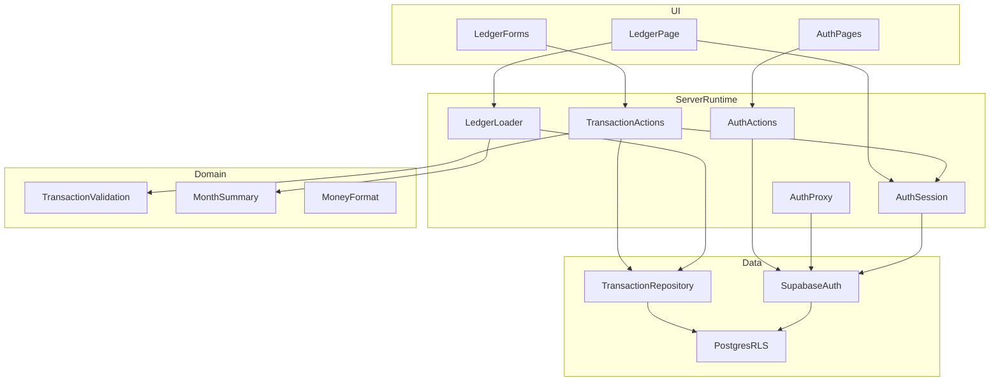
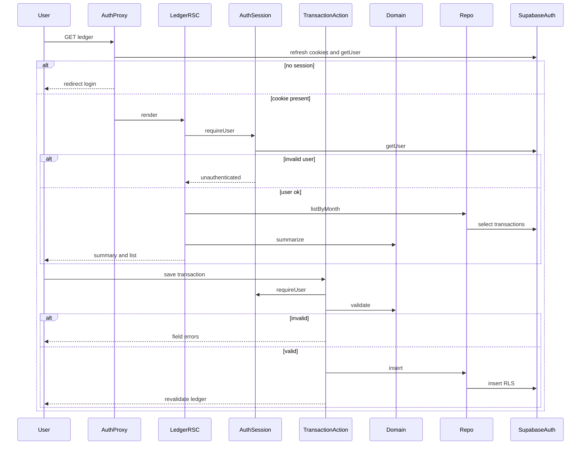
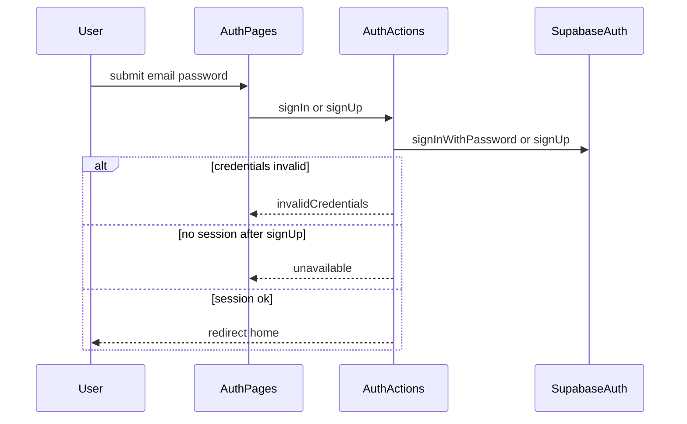
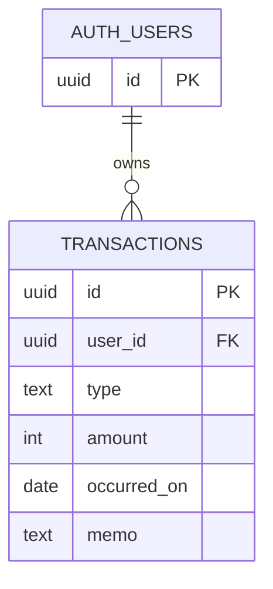

# Design Document

## Overview

本仕様は、個人利用者が自分の収入と支出を記録し、暦月単位で収支を把握する家計簿アプリケーションを実現する。対象は一人で家計を管理する利用者である。世帯共有や外部口座連携は扱わない。

利用者の本人確認は **Supabase Auth** のメールとパスワードに限定する。パスワードはアプリのデータストアに置かない。認証後に家計画面で記録の追加・一覧・月次要約・修正・削除を行う。未認証およびセッション未確立では家計データを表示しない。

現状の Next.js 初期テンプレートを家計簿の土台に置き換える。認証の正は Supabase Auth、永続化の正は PostgreSQL と RLS とする。

### Goals

- Supabase Auth により認証済みとなった利用者だけが、自分の収支を記録・閲覧・更新・削除できる
- 家計画面は要約、追加操作、明細の順で、対象月の収入合計・支出合計・差引を一覧と一致させる
- 金額は日本円の整数。認可は RLS。アプリはユーザーセッション付きクライアントのみ使う

### Non-Goals

- 複数人共有、招待、ロール、OAuth ソーシャルログイン、MFA、パスワード再設定メールフロー
- カテゴリ（`categories` テーブル、取引の `category_id`）
- 銀行連携、レシート OCR、予算上限、グラフ
- 独自 REST / GraphQL サーバー、service role のブラウザ同梱
- ダークモードの手動切替、多通貨

## Boundary Commitments

### This Spec Owns

- Supabase Auth を用いたメール/パスワードの登録・ログイン・ログアウト、Cookie セッション、家計画面への誘導
- メール確認待ちなどセッション未確立時に家計データを出さないこと
- `transactions` のスキーマ、RLS、ドメイン検証、月次集計の純関数
- 家計画面（要約・フォーム・一覧）と認証画面。テンプレート案内の除去
- Server Action / RSC と Supabase クライアントの契約

### Out of Boundary

- Supabase プロジェクトの課金・リージョン・メールプロバイダ・確認メールのオンオフ運用
- `categories` および取引へのカテゴリ付与（本仕様の対象外。リモートに残さない）
- `auth.users` 内部スキーマの変更（Auth が所有）
- MCP サーバー自体の設置（スキーマ変更の手順は steering。実行時パスではない）
- CI 閾値、E2E フレームワークの最終選定（テスト方針は steering に従い Vitest を既定とする）

### Allowed Dependencies

- Next.js 16 App Router、React 19、TypeScript strict、Tailwind CSS 4
- `@supabase/supabase-js` と `@supabase/ssr`
- 公開環境変数 `NEXT_PUBLIC_SUPABASE_URL` / `NEXT_PUBLIC_SUPABASE_ANON_KEY` のみ
- Auth の PKCE コード交換に限り `app/auth/callback` の Route Handler（一般 API は置かない）

### Revalidation Triggers

- `transactions` 列や `type` の意味の変更
- `categories` や `category_id` を本仕様へ取り込む場合
- RLS 述語または `user_id` 所有モデルの変更
- 認証フロー（確認メール必須化、IdP 追加）で「登録完了」またはセッション契約が変わる場合
- 読み書きを Server Action 以外へ移す場合
- Proxy を唯一の認可境界に変える場合

## Architecture

### Existing Architecture Analysis

現行は `src/app` のレイアウトとスタートページのみ。再利用するドメイン境界はない。踏襲するのは App Router、`src/`、`@/`、RSC 既定である。認証・データ層は新設する。

リモート Postgres には先行して `categories` と、取引の `date` / `category_id` / `updated_at` があった。本仕様の正は Physical Data Model であり、当該差分はマイグレーションで除去済みとする。アプリ実装は `occurred_on` 付きの `transactions` のみを前提にする。

### Architecture Pattern & Boundary Map

選択パターンは **薄いレイヤー構成** である。依存方向は **Types → Domain → Repository → Server runtime → UI**。UI と Runtime は Domain / Types 以外へ逆流しない。Repository は Supabase 以外の永続化を知らない。Auth のユーザー実体は Supabase Auth に閉じ、家計ドメインは `userId` 文字列だけを見る。



- 認証の正は Supabase Auth のセッション（サーバーで `getUser`）。Proxy は Cookie 更新と楽観的リダイレクトのみ。
- 認可の正は Postgres RLS。Repository の `user_id` 条件は防御的であり、省略しても他ユーザー行は返らない前提とする。
- ブラウザは anon key のみ。service role はアプリケーションコードに置かない。

### Technology Stack

| Layer | Choice / Version | Role in Feature | Notes |
|-------|------------------|-----------------|-------|
| Frontend | Next.js 16.3 App Router, React 19, Tailwind 4 | 認証画面と家計画面 | RSC 既定。フォームは Client。入口は `proxy.ts` |
| Backend | Next.js Server Actions, Proxy | 変更・セッション更新・ルート誘導 | 独自 API は Auth callback 以外置かない |
| Data | Supabase Auth + Postgres | ユーザーと `transactions` | RLS 必須。パスワードは Auth 管理 |
| Client libs | `@supabase/ssr`, `@supabase/supabase-js` | Cookie セッションと Data API | `cookies()` は await。検証は `getUser` |
| Infra | Node 上の Next ランタイム | `npm run dev` / `build` | シークレットは環境変数 |

詳細比較は `research.md`。

## File Structure Plan

### Directory Structure

```
src/
├── app/
│   ├── globals.css
│   ├── layout.tsx                 # シェル。メタデータを家計簿向けに更新
│   ├── login/page.tsx
│   ├── signup/page.tsx
│   ├── auth/callback/route.ts     # PKCE コード交換のみ
│   └── page.tsx                   # 家計ホーム RSC
├── components/
│   ├── auth/                      # ログイン・登録フォーム
│   └── ledger/                    # 要約、記録フォーム、一覧、空状態、月切替
├── lib/
│   ├── money.ts
│   ├── month.ts
│   ├── result.ts
│   ├── supabase/
│   │   ├── client.ts
│   │   ├── server.ts
│   │   └── proxy.ts               # Cookie 更新ヘルパ
│   ├── auth/
│   │   ├── types.ts
│   │   └── session.ts             # AuthSession DAL
│   └── transactions/
│       ├── types.ts
│       ├── validation.ts
│       ├── summary.ts
│       └── repository.ts
├── actions/
│   ├── auth.ts
│   └── transactions.ts
└── proxy.ts                       # セッション Cookie 更新と楽観的リダイレクト
```

### Modified Files

- `src/app/page.tsx` — テンプレートを家計ホームに置換（7.5）
- `src/app/layout.tsx` — タイトル・説明。認証状態はページ側で扱う
- `package.json` — `@supabase/ssr` と `@supabase/supabase-js` を追加

## System Flows

未認証の家計アクセスは AuthProxy が `/login` へ送る。ログイン成功後は `/` の RSC が AuthSession で利用者を確定し、対象月の行を読み Domain で要約する。





保存中は Client フォームが送信ボタンを無効化する（2.5）。削除は確認後にだけ Action を呼ぶ（5.2, 5.3）。

## Requirements Traceability

| Requirement | Summary | Components | Interfaces | Flows |
|-------------|---------|------------|------------|-------|
| 1.1 | 登録後に家計へ | AuthPages, AuthActions, AuthSession | AuthService | 認証 |
| 1.2 | ログイン成功 | AuthPages, AuthActions | AuthService | 認証 |
| 1.3 | 誤認証情報 | AuthPages, AuthActions | AuthError | 認証 |
| 1.4 | ログアウト | AuthActions, AuthProxy | AuthService | 認証 |
| 1.5 | 認証済みのみ家計 | AuthProxy, AuthSession, LedgerPage | AuthSession | 認証 |
| 1.6 | Supabase Auth のみ | AuthActions, AuthSession | AuthService | 認証 |
| 1.7 | Cookie セッション | AuthProxy, AuthSession | AuthSession | 認証 |
| 1.8 | セッション未確立 | AuthActions, AuthPages | AuthError | 認証 |
| 2.1, 2.2, 2.6 | 記録の保存 | TransactionValidation, TransactionRepository, TransactionActions | TransactionWrite | 記録保存 |
| 2.3, 2.4 | 検証エラー | TransactionValidation, LedgerForms | FieldErrors | 記録保存 |
| 2.5 | 保存中の再実行防止 | LedgerForms | FormPending | 記録保存 |
| 3.1–3.5 | 一覧 | LedgerLoader, TransactionList | TransactionRead | 家計表示 |
| 4.1–4.5 | 月次要約 | MonthRange, MonthSummary, MonthSwitcher, LedgerLoader | MonthQuery | 家計表示 |
| 5.1–5.3 | 修正と削除確認 | TransactionActions, LedgerForms | TransactionWrite | 記録保存 |
| 5.4, 6.1, 6.4 | 他者データと非共有 | RLS, TransactionRepository | RlsPolicies | 認可 |
| 6.2 | 未認証は認証へ | AuthProxy | AuthProxy | 認証 |
| 6.3 | 取得・保存失敗 | LedgerPage, LedgerForms | AppError | 記録保存 |
| 7.1–7.5 | 画面構成 | LedgerPage, LedgerForms | LedgerLayout | 家計表示 |

## Components and Interfaces

| Component | Domain/Layer | Intent | Req Coverage | Key Dependencies | Contracts |
|-----------|--------------|--------|--------------|------------------|-----------|
| AuthProxy | Server runtime | Cookie 更新と楽観的ルート誘導 | 1.4, 1.5, 1.7, 6.2 | Supabase SSR P0 | Service |
| AuthSession | Server runtime | サーバーで利用者を確定する | 1.5, 1.6, 1.7, 1.8 | Supabase Auth P0 | Service |
| AuthService | Server runtime | 登録・ログイン・ログアウト | 1.1–1.4, 1.6, 1.8 | Supabase Auth P0 | Service |
| AuthCallback | Server runtime | 確認メール後のコード交換 | 1.1, 1.7 | Supabase Auth P0 | API |
| TransactionValidation | Domain | 入力をドメイン値に変換 | 2.1–2.4, 2.6, 5.1 | Types P0 | Service |
| MonthSummary | Domain | 月次合計と差引 | 4.1, 4.3, 4.5 | Money P0 | Service |
| TransactionRepository | Data | 自分の行の CRUD | 2.1, 3.1, 5.1, 5.2, 5.4 | Supabase P0, RLS P0 | Service |
| TransactionActions | Server runtime | 検証して永続化し再検証 | 2, 5, 6.3, 7.4 | AuthSession P0, Validation P0, Repo P0 | Service |
| LedgerLoader | Server runtime | 対象月の行取得 | 3.1, 4.2, 4.4 | Repo P0, Month P0 | Service |
| AuthPages / Ledger UI | UI | 画面と pending | 3.2–3.4, 7.x, 2.5, 1.3 | Actions P0 | State |

### Types

共有の結果型。`any` は使わない。

```typescript
type Result<T, E> = { ok: true; value: T } | { ok: false; error: E };

type AuthError =
  | { kind: "invalidCredentials" }
  | { kind: "unavailable"; message: string };

type SessionUser = {
  userId: string;
  email: string;
};

type FieldErrors = { fields: Record<string, string> };

type AppError =
  | { kind: "validation"; fields: Record<string, string> }
  | { kind: "unauthenticated" }
  | { kind: "notFound" }
  | { kind: "unavailable"; message: string };

type TransactionType = "income" | "expense";

type Transaction = {
  id: string;
  userId: string;
  type: TransactionType;
  amountYen: number;
  occurredOn: string;
  memo: string | null;
};

type TransactionDraft = {
  type: TransactionType;
  amountYen: number;
  occurredOn: string;
  memo: string | null;
};

type MonthId = string;

type MonthSummaryView = {
  incomeTotalYen: number;
  expenseTotalYen: number;
  netYen: number;
};
```

`SessionUser.userId` は Supabase Auth のユーザー UUID。`occurredOn` と `MonthId` は暦日付 / `YYYY-MM` の文字列。`amountYen` は 1 以上の整数。

### Server runtime

#### AuthProxy

| Field | Detail |
|-------|--------|
| Intent | Cookie セッションを更新し、家計ルートと認証ルートを振り分ける |
| Requirements | 1.5, 1.7, 6.2, 1.4 |

**Responsibilities & Constraints**

- マッチしたリクエストごとに Cookie を更新する
- 未認証の `/` は `/login` へ。認証済みの `/login` `/signup` は `/` へ
- 家計データを描画しない。JWT の独自検証や DB 照会をしない
- Next.js 16 の `proxy.ts` を使う。認可の正ではない

**Dependencies**

- External: `@supabase/ssr` createServerClient — セッション Cookie（P0）

**Contracts**: Service [x]

```typescript
interface AuthProxyService {
  updateSession(request: Request): Promise<Response>;
}
```

- Preconditions: Supabase 公開環境変数が設定済み
- Postconditions: 応答 Cookie に更新済みセッションが乗る場合がある
- Invariants: 未認証レスポンスに取引ペイロードを含めない。応答から Auth Cookie を落とさない

#### AuthSession

| Field | Detail |
|-------|--------|
| Intent | サーバー上で Supabase Auth の利用者を確定する |
| Requirements | 1.5, 1.6, 1.7, 1.8 |

**Responsibilities & Constraints**

- `auth.getUser()` で検証する。`getSession()` だけで通行させない
- 失敗時は `unauthenticated`。家計読取・変更を続けない
- `userId` をクライアント入力から取らない

**Dependencies**

- External: サーバー用 Supabase クライアント — Auth（P0）

**Contracts**: Service [x]

```typescript
interface AuthSessionService {
  requireUser(): Promise<Result<SessionUser, AppError>>;
}
```

- Preconditions: Cookie にセッション候補がある場合と無い場合の両方を扱う
- Postconditions: `ok` のとき `userId` は Auth の UUID
- Invariants: パスワードや refresh token を戻り値に含めない

#### AuthService

| Field | Detail |
|-------|--------|
| Intent | メール/パスワードでセッションを確立または破棄する |
| Requirements | 1.1, 1.2, 1.3, 1.4, 1.6, 1.8 |

```typescript
interface AuthService {
  signUp(email: string, password: string): Promise<Result<{ redirectTo: "/" }, AuthError>>;
  signIn(email: string, password: string): Promise<Result<{ redirectTo: "/" }, AuthError>>;
  signOut(): Promise<Result<{ redirectTo: "/login" }, AuthError>>;
}
```

- 呼び出しは Server Action。ブラウザから Auth Admin API を呼ばない（1.6）
- 誤パスワードは `invalidCredentials`。家計へ進めない（1.3）
- 登録後にセッションが無い（メール確認待ち）は `unavailable`。家計データは出さない（1.1, 1.8）
- ログアウト後は Cookie セッションを破棄し家計へ進めなくする（1.4）

#### AuthCallback

| Field | Detail |
|-------|--------|
| Intent | メール確認などによる PKCE コードをセッション Cookie に交換する |
| Requirements | 1.1, 1.7 |

**Contracts**: API [x]

| Method | Endpoint | Request | Response | Errors |
|--------|----------|---------|----------|--------|
| GET | /auth/callback | `code` クエリ | `/` へリダイレクト | 失敗時は `/login` |

- 一般の CRUD JSON API ではない
- 交換失敗では家計データを返さない（1.8）

#### TransactionActions

| Field | Detail |
|-------|--------|
| Intent | 下書きを検証し、自分の記録だけを変更して家計パスを再検証する |
| Requirements | 2.1–2.5, 5.1–5.4, 6.3, 7.4 |

```typescript
interface TransactionActions {
  create(draft: unknown): Promise<Result<{ id: string }, AppError>>;
  update(id: string, draft: unknown): Promise<Result<{ id: string }, AppError>>;
  delete(id: string, confirmed: boolean): Promise<Result<void, AppError>>;
}
```

- Preconditions: `AuthSession.requireUser` が成功。`delete` は `confirmed === true` のときだけ削除（5.3）
- Postconditions: 成功時 `revalidatePath('/')`
- Invariants: `user_id` をクライアント入力で上書きしない。サーバーがセッションユーザーを付ける

#### LedgerLoader

```typescript
interface LedgerLoader {
  load(monthId: MonthId | null): Promise<
    Result<{ monthId: MonthId; items: Transaction[]; summary: MonthSummaryView }, AppError>
  >;
}
```

- 呼び出し元は先に `requireUser` する
- `monthId` が null のとき、現在の暦月（4.4）
- 0 件でも summary は 0 円（4.3）

### Domain

#### TransactionValidation

```typescript
interface TransactionValidation {
  parseDraft(input: unknown): Result<TransactionDraft, FieldErrors>;
}
```

- 種別欠落、発生日欠落、金額未入力・0 以下・非整数はフィールドエラー（2.3, 2.4）
- メモ空は `null`

#### MonthSummary / Money / Month

```typescript
interface MonthRange {
  fromMonthId(monthId: MonthId): { startDate: string; nextStartDate: string };
  currentMonthId(now: Date): MonthId;
}

interface MonthSummaryCalculator {
  summarize(items: Transaction[]): MonthSummaryView;
}

interface MoneyFormatter {
  formatYen(amountYen: number): string;
}
```

- `netYen = incomeTotalYen - expenseTotalYen`
- 表示は `ja-JP` の通貨スタイル（3.5, 4.5）
- `MonthSummaryCalculator` は Repository を呼ばない

### Data

#### TransactionRepository

```typescript
interface TransactionRepository {
  listByMonth(userId: string, monthId: MonthId): Promise<Result<Transaction[], AppError>>;
  getById(userId: string, id: string): Promise<Result<Transaction, AppError>>;
  insert(userId: string, draft: TransactionDraft): Promise<Result<Transaction, AppError>>;
  update(userId: string, id: string, draft: TransactionDraft): Promise<Result<Transaction, AppError>>;
  remove(userId: string, id: string): Promise<Result<void, AppError>>;
}
```

- 他ユーザー行は RLS で見えない。見えない更新は `notFound`（5.4）
- 失敗は `unavailable`（6.3）

### UI（summary-only）

- **LedgerPage**: 要約 → 主アクション「記録を追加」→ 明細（7.1, 7.3）。テンプレート CTA を出さない（7.5）。未認証では描画しない
- **LedgerForms**: ラベル必須（7.2）。pending 中は保存ボタン無効（2.5）。エラーは入力近く（7.4）
- **TransactionList**: 種別文言、金額、発生日、メモ（3.2, 3.3）。空状態は記録誘導（3.4）
- **MonthSwitcher**: 対象月変更で loader の month を更新（4.2）
- **AuthPages**: 失敗時に家計を出さない（1.3, 1.8）。メールとパスワードのみ

## Data Models

### Domain Model

- 集約ルート: `Transaction`（所有者 `userId` は Auth ユーザーと一致）
- 認証主体: Supabase Auth の User。アプリは `SessionUser` として参照するだけ
- 値: `amountYen`（正の整数円）、`occurredOn`（暦日）、`MonthId`
- 不変条件: `type` は `income` | `expense`。メモは任意。共有所有なし。パスワードは集約に含めない



### Logical Data Model

- 1 Auth 利用者 : 多 `transactions`
- 自然キーなし。サロゲート `id`
- 月次は `occurred_on` の半開区間。別エンティティにしない
- 認証資格情報は `auth` スキーマ。アプリは参照のみ

### Physical Data Model

`auth.users` は Supabase Auth が所有する。本仕様は DDL しない。

テーブル `public.transactions`:

- `id` uuid PK default `gen_random_uuid()`
- `user_id` uuid NOT NULL REFERENCES `auth.users(id)` ON DELETE CASCADE
- `type` text NOT NULL CHECK (`type` IN ('income', 'expense'))
- `amount` integer NOT NULL CHECK (`amount` > 0)
- `occurred_on` date NOT NULL
- `memo` text NULL
- `created_at` timestamptz NOT NULL default `now()`

索引: `(user_id, occurred_on DESC)`。

RLS: ENABLE。`TO authenticated` のみ。

- SELECT `USING ((select auth.uid()) = user_id)`
- INSERT `WITH CHECK ((select auth.uid()) = user_id)`
- UPDATE `USING` と `WITH CHECK` の両方で同一比較（`user_id` 変更不可）
- DELETE `USING ((select auth.uid()) = user_id)`

`anon` には表への GRANT をしない。共有用カラムは作らない（6.4）。

スキーマ適用は MCP `apply_migration` または同等。アプリ起動時に DDL しない。

### Data Contracts & Integration

- 認証フォーム → Auth Action は email / password の未検証入力。成功後は `/` へ
- 家計フォーム → Action は未検証 `unknown`。成功後は RSC が Repository 経由で再読込
- クエリ `?month=YYYY-MM`。不正値は当月へフォールバック（4.4）

## Error Handling

### Error Strategy

境界で `Result` に変換する。UI は `kind` で分岐する。スタックや SQL、Auth の生エラーは出さない。

### Error Categories and Responses

- 検証: `validation.fields` を入力近く（2.3, 2.4, 7.4）
- 認証: ログインまたは登録画面の短文。家計データなし（1.3, 1.8, 6.2）
- 欠落: 他者 ID 含む。一覧を維持し記録は変えない（5.4）
- 基盤: 取得・保存失敗は既存表示を消さず失敗を示す（6.3）

監視はブラウザとサーバーの標準ログに留める。本仕様では外部 APM を導入しない。パスワードをログに出さない。

## Testing Strategy

steering `testing.md` に従う。本番プロジェクトは叩かない。

- Unit: `parseDraft`、`summarize`、`formatYen`、月の半開区間、`confirmed === false` で delete しない
- Integration: Auth と Repository をモックした Action。未ログインの Action は `unauthenticated`。RLS はステージングで操作別に確認
- E2E（任意）: 登録またはログイン → 支出 1 件 → 要約更新 → 削除確認。ログアウト後に家計へ戻れないこと

## Security Considerations

- 認証は Supabase Auth。アプリにパスワードハッシュを持たない（1.6）
- 認可は RLS。アプリの `eq('user_id')` は補助。Proxy は唯一の防衛にしない
- サーバー検証は `getUser`。anon key のみ公開。service role 禁止
- パスワードはログに出さない
- 個人家計データ。共有 URL や公開一覧は作らない

## Migration Strategy

1. パッケージ追加と環境変数
2. リモートを本 Physical Data Model に合わせる（完了済み）
   - `categories` を削除する（仕様対象外）
   - `transactions.date` を `occurred_on` に改名する
   - `category_id` と `updated_at` を削除する
   - `memo` を NULL 可にする。索引は `(user_id, occurred_on DESC)`
3. 以降の DDL は設計どおりの `transactions` と RLS のみ。アプリ起動時に DDL しない
4. Supabase クライアント、`proxy.ts`、Auth Action、認証画面、必要なら Auth callback
5. 家計 RSC / Action / UI（テンプレート置換）

ロールバックはマイグレーションの down とルート差し戻し。家計の本番データはない前提。カテゴリを後から足す場合は別仕様とする。
